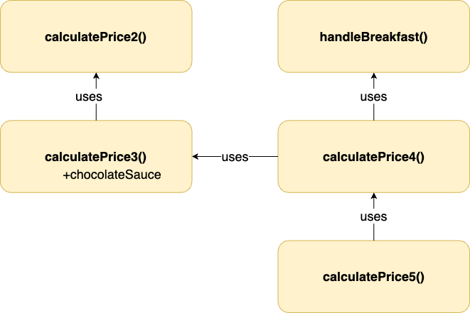

# Design

- **Web/App UI:** Web application will take less time to implement and can be used in different platforms.
- **Language:** Javascript is a good choice for web application. Typescript is also a good choice but it will take more time to implement.
- **Testing:** Use Mocha for unit testing. Mocha is a popular testing framework for Javascript.

# Implementation

- All functions will be implemented as described in the problem statement.
- Functions will be implemented in Javascript. Later, we can build a UI on top of it easily.
- The functions will be implemented in a way that they can be used in a browser.
- **Maximize code reuse** to minimize code duplication and make it easier to change the code later.
- **The pricing should be easy to change**. For example, we should be able to change the price of a coffee without changing the code.

**More details:**

- The functions will be implemented in `calculator.js`.
- Pricing are stored in `constants.js`. This is to make it easier to change the pricing later.
- Function `calculatePrice3()` reuses `calculatePrice2()` with additional `chocolateSauce` parameter.
- For `calculatePrice4()`, a new function for handling breakfast item was created - `handleBreakFast()`. The function `calculatePrice4()` is then implemented using `calculatePrice3()` and `handleBreakFast()`.
- Function `calculatePrice5()` is implemented by calling `calculatePrice4()` on single items.

# Testing

- The unit tests will be implemented in `calculator.test.js` using Mocha.
- Run the tests with `npm test`.
